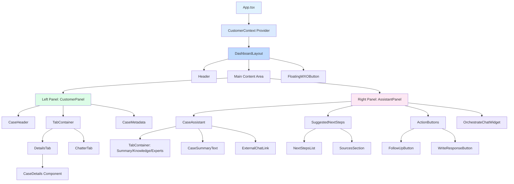
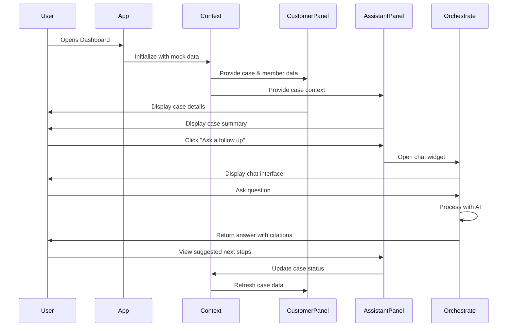

# Component Hierarchy & Data Flow

## Visual Component Tree



## Component Responsibilities

### Layout Components

#### `App.tsx`
- Root component
- Sets up CustomerContext provider
- Manages global state
- Handles routing (if needed)

#### `DashboardLayout.tsx`
- Main layout container
- Implements split-panel design
- Handles responsive behavior
- Manages panel resizing

#### `Header.tsx`
- BCBSKS branding
- User profile/settings
- Navigation breadcrumbs
- Global actions

#### `FloatingWXOButton.tsx`
- Fixed position button
- Toggle chat visibility
- Animation effects
- Badge for notifications

### Customer Panel Components (Left Side)

#### `CustomerPanel.tsx`
- Container for all customer info
- Manages tab state
- Coordinates child components

#### `CaseHeader.tsx`
```typescript
interface CaseHeaderProps {
  caseNumber: string;
  subject: string;
  status: CaseStatus;
  priority: CasePriority;
}
```
- Displays case title and number
- Shows status badge
- Priority indicator
- Quick action menu

#### `CaseDetails.tsx`
```typescript
interface CaseDetailsProps {
  case: Case;
  member: Member;
}
```
- Form-like layout for case fields
- Editable fields (future)
- Field validation
- Save/cancel actions

#### `ChatterTab.tsx`
- Activity feed
- Comments/notes
- File attachments
- Timeline view

#### `CaseMetadata.tsx`
```typescript
interface CaseMetadataProps {
  metadata: Record<string, any>;
}
```
- Grid layout for additional fields
- Custom BCBSKS fields
- Read-only display
- Expandable sections

### Assistant Panel Components (Right Side)

#### `AssistantPanel.tsx`
- Container for AI assistant features
- Manages assistant state
- Coordinates with Orchestrate

#### `CaseAssistant.tsx`
```typescript
interface CaseAssistantProps {
  caseSummary: string;
  onTabChange: (tab: string) => void;
}
```
- "Understand this case" section
- Tab navigation (Summary/Knowledge/Experts)
- Summary text display
- External chat link

#### `SuggestedNextSteps.tsx`
```typescript
interface SuggestedNextStepsProps {
  steps: string[];
  sources?: Source[];
  onStepComplete?: (stepIndex: number) => void;
}
```
- Bulleted list of action items
- Checkbox for completion
- Sources expandable section
- Citation links

#### `ActionButtons.tsx`
```typescript
interface ActionButtonsProps {
  onFollowUp: () => void;
  onWriteResponse: () => void;
}
```
- "Ask a follow up" button
- "Write response" button
- Additional action buttons
- Loading states

#### `OrchestrateChatWidget.tsx`
```typescript
interface OrchestrateChatWidgetProps {
  config: WXOConfiguration;
  containerId?: string;
  onLoad?: () => void;
  onError?: (error: Error) => void;
}
```
- Embeds watsonx Orchestrate chat
- Handles script loading
- Manages initialization
- Error handling

## Data Flow Diagram



## State Management

### Global State (Context)
```typescript
interface CustomerContextState {
  currentCase: Case | null;
  currentMember: Member | null;
  caseSummary: string;
  suggestedNextSteps: string[];
  sources: Source[];
  loading: boolean;
  error: Error | null;
}

interface CustomerContextActions {
  setCurrentCase: (case: Case) => void;
  setCurrentMember: (member: Member) => void;
  updateCaseSummary: (summary: string) => void;
  addNextStep: (step: string) => void;
  completeNextStep: (stepIndex: number) => void;
}
```

### Local Component State
- Tab selections (Details/Chatter, Summary/Knowledge/Experts)
- Form input values
- UI toggles (expanded/collapsed sections)
- Loading indicators
- Error messages

## Props Interface Summary

### Common Props Pattern
```typescript
// Base props for all components
interface BaseComponentProps {
  className?: string;
  style?: React.CSSProperties;
  testId?: string;
}

// Data-driven components
interface DataComponentProps<T> extends BaseComponentProps {
  data: T;
  loading?: boolean;
  error?: Error | null;
  onRefresh?: () => void;
}

// Interactive components
interface InteractiveComponentProps extends BaseComponentProps {
  disabled?: boolean;
  onClick?: () => void;
  onChange?: (value: any) => void;
}
```

## Component Communication Patterns

### Parent-to-Child (Props)
- Pass data down through props
- Pass callback functions for events
- Use TypeScript for type safety

### Child-to-Parent (Callbacks)
- Event handlers passed as props
- State updates via callbacks
- Custom events for complex interactions

### Sibling-to-Sibling (Context)
- Use CustomerContext for shared state
- Avoid prop drilling
- Centralized state management

### External Integration (Orchestrate)
- Script-based embedding
- Window object configuration
- Event listeners for chat events

## Styling Strategy

### CSS Modules Approach
```typescript
// Component.module.css
.container {
  display: flex;
  gap: 1rem;
}

.panel {
  background: white;
  border-radius: 0.5rem;
  box-shadow: 0 1px 3px rgba(0,0,0,0.1);
}

// Component.tsx
import styles from './Component.module.css';

export const Component = () => (
  <div className={styles.container}>
    <div className={styles.panel}>...</div>
  </div>
);
```

### Utility Classes (Optional Tailwind)
```typescript
// If using Tailwind CSS
export const Component = () => (
  <div className="flex gap-4">
    <div className="bg-white rounded-lg shadow-sm">...</div>
  </div>
);
```

This component hierarchy provides a clear structure for building the dashboard with proper separation of concerns and maintainable code organization.