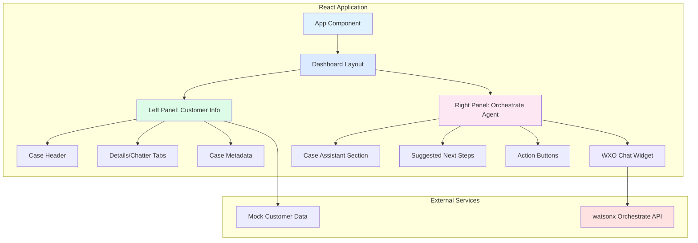

# BCBSKS Customer Representative Dashboard - Implementation Plan

## Project Overview
Building a React + Vite dashboard for BCBSKS customer service representatives that embeds the watsonx Orchestrate agent alongside customer/case information. This creates a unified workspace for reps to handle member inquiries with AI assistance.

## Architecture Overview



## Technology Stack

### Core Framework
- **React 18+**: Component-based UI framework
- **Vite**: Fast build tool and dev server
- **TypeScript**: Type-safe development

### Styling
- **CSS Modules** or **Tailwind CSS**: Component styling
- **Salesforce Lightning Design System** inspiration for UI patterns

### State Management
- **React Context API**: For global state (customer data, case info)
- **useState/useEffect**: Local component state

### Integration
- **watsonx Orchestrate**: Embedded chat widget via provided script

## Project Structure

```
bcbsks-rep-dashboard/
├── public/
│   └── index.html
├── src/
│   ├── assets/
│   │   ├── icons/
│   │   └── images/
│   ├── components/
│   │   ├── layout/
│   │   │   ├── DashboardLayout.tsx
│   │   │   ├── Header.tsx
│   │   │   └── FloatingWXOButton.tsx
│   │   ├── customer/
│   │   │   ├── CustomerPanel.tsx
│   │   │   ├── CaseHeader.tsx
│   │   │   ├── CaseDetails.tsx
│   │   │   ├── CaseChatter.tsx
│   │   │   └── CaseMetadata.tsx
│   │   └── assistant/
│   │       ├── AssistantPanel.tsx
│   │       ├── CaseAssistant.tsx
│   │       ├── SuggestedNextSteps.tsx
│   │       ├── ActionButtons.tsx
│   │       └── OrchestrateChatWidget.tsx
│   ├── context/
│   │   └── CustomerContext.tsx
│   ├── data/
│   │   └── mockCustomerData.ts
│   ├── types/
│   │   ├── customer.types.ts
│   │   └── case.types.ts
│   ├── hooks/
│   │   └── useOrchestrate.ts
│   ├── styles/
│   │   ├── global.css
│   │   └── variables.css
│   ├── App.tsx
│   ├── main.tsx
│   └── vite-env.d.ts
├── package.json
├── tsconfig.json
├── vite.config.ts
└── README.md
```

## Component Breakdown

### 1. Dashboard Layout (Split Panel)
**File**: `src/components/layout/DashboardLayout.tsx`

**Features**:
- Two-column layout (60/40 or 50/50 split)
- Responsive design with collapsible panels
- Header with BCBSKS branding

**Props**:
```typescript
interface DashboardLayoutProps {
  leftPanel: React.ReactNode;
  rightPanel: React.ReactNode;
}
```

### 2. Customer Information Panel (Left Side)
**File**: `src/components/customer/CustomerPanel.tsx`

**Sub-components**:

#### a. Case Header
- Case title and status badge
- Case number and priority indicator
- Quick action icons

#### b. Details/Chatter Tabs
- **Details Tab**: Shows case metadata in a form-like layout
  - Subject
  - Description
  - Priority
  - Status
  - Owner
  - Created Date
  - Last Modified
  
- **Chatter Tab**: Activity feed/notes section (future enhancement)

#### c. Case Metadata Section
- Additional fields in a grid layout
- Custom fields specific to BCBSKS (Member ID, Policy Type, LOB, etc.)

### 3. Assistant Panel (Right Side)
**File**: `src/components/assistant/AssistantPanel.tsx`

**Sub-components**:

#### a. Case Assistant Section
- Header with icon and "Understand this case" title
- Tabs: Summary | Knowledge | Experts
- Case summary text area
- Link to external chat (if needed)

#### b. Suggested Next Steps
- Bulleted list of AI-generated action items
- Checkboxes for completion tracking
- "Sources" expandable section with citations

#### c. Action Buttons
- "Ask a follow up" button
- "Write response with Glean" button (or similar)
- Integration hooks for future actions

#### d. Orchestrate Chat Widget
- Embedded watsonx Orchestrate chat
- Positioned within the assistant panel
- Configurable size and behavior

### 4. Floating WXO Button
**File**: `src/components/layout/FloatingWXOButton.tsx`

**Features**:
- Fixed position bottom-right corner
- Navy blue circular button with "WXO" text
- Click to expand/collapse chat widget
- Smooth animations

## Data Models

### Customer/Member Data Structure
```typescript
interface Member {
  id: string;
  firstName: string;
  lastName: string;
  memberId: string;
  dateOfBirth: string;
  policyNumber: string;
  lineOfBusiness: 'Commercial' | 'Medicare Advantage' | 'Medicaid';
  planType: string;
  effectiveDate: string;
  phone: string;
  email: string;
}

interface Case {
  id: string;
  caseNumber: string;
  subject: string;
  description: string;
  status: 'New' | 'In Progress' | 'Pending' | 'Resolved' | 'Closed';
  priority: 'Low' | 'Medium' | 'High' | 'Critical';
  type: 'Prior Auth' | 'Benefits Question' | 'Claims' | 'General Inquiry';
  owner: string;
  createdDate: string;
  lastModified: string;
  memberId: string;
}

interface CaseContext {
  member: Member;
  case: Case;
  suggestedNextSteps: string[];
  caseSummary: string;
}
```

## watsonx Orchestrate Integration

### Implementation Strategy

1. **Script Loading**: Load the Orchestrate script dynamically in a React component
2. **Configuration**: Use the provided configuration object
3. **Container Element**: Create a dedicated div with id="root" for the chat widget
4. **Initialization**: Call `wxoLoader.init()` after script loads

### Integration Component
**File**: `src/components/assistant/OrchestrateChatWidget.tsx`

```typescript
useEffect(() => {
  // Set up configuration
  window.wxOConfiguration = {
    orchestrationID: "ad4fa6953138448689fb746aade5025e_3f8fb562-4a6f-4cec-92a2-1172811cffee",
    hostURL: "https://us-south.watson-orchestrate.cloud.ibm.com",
    rootElementID: "orchestrate-chat-container",
    deploymentPlatform: "ibmcloud",
    crn: "crn:v1:bluemix:public:watsonx-orchestrate:us-south:a/ad4fa6953138448689fb746aade5025e:3f8fb562-4a6f-4cec-92a2-1172811cffee::",
    chatOptions: {
      agentId: "18015fee-4a97-4b2f-885d-fa9be453627b",
      agentEnvironmentId: "9cbdfa15-f4cc-4163-a6c2-248c9dd47aa8",
    }
  };

  // Load script
  const script = document.createElement('script');
  script.src = `${window.wxOConfiguration.hostURL}/wxochat/wxoLoader.js?embed=true`;
  script.addEventListener('load', () => {
    if (window.wxoLoader) {
      window.wxoLoader.init();
    }
  });
  document.head.appendChild(script);

  return () => {
    // Cleanup
    document.head.removeChild(script);
  };
}, []);
```

## Mock Data Strategy

### Sample Customer Data
Create realistic BCBSKS member scenarios:

1. **Prior Authorization Case**
   - Member: John Smith, Medicare Advantage
   - Issue: Outpatient imaging prior auth request
   - Status: In Progress

2. **Benefits Question Case**
   - Member: Sarah Johnson, Commercial
   - Issue: Coverage question for specialist visit
   - Status: New

3. **Claims Issue Case**
   - Member: Robert Davis, Medicaid
   - Issue: Claim denial inquiry
   - Status: Pending

### Data Location
**File**: `src/data/mockCustomerData.ts`

Export multiple case scenarios that can be switched via a dropdown or URL parameter.

## Styling Guidelines

### Color Palette (Based on Sample UI)
- **Primary Blue**: `#0176d3` (Salesforce blue)
- **Light Blue**: `#e0f2fe` (backgrounds)
- **Navy**: `#1e3a8a` (WXO button)
- **Gray**: `#6b7280` (text)
- **White**: `#ffffff` (panels)
- **Success Green**: `#16a34a`
- **Warning Orange**: `#d97706`
- **Error Red**: `#dc2626`

### Layout Specifications
- **Left Panel**: 60% width on desktop, full width on mobile
- **Right Panel**: 40% width on desktop, overlay on mobile
- **Panel Padding**: 1.5rem (24px)
- **Border Radius**: 0.5rem (8px) for cards
- **Shadow**: Subtle drop shadows for depth

### Typography
- **Font Family**: System fonts (San Francisco, Segoe UI, Roboto)
- **Headings**: Bold, appropriate sizing hierarchy
- **Body Text**: Regular weight, good contrast ratio

## Development Phases

### Phase 1: Foundation (Days 1-2)
- Set up Vite + React + TypeScript project
- Create basic layout structure
- Implement mock data models
- Basic styling setup

### Phase 2: Customer Panel (Days 3-4)
- Build customer information components
- Implement tabs (Details/Chatter)
- Add case metadata display
- Style to match sample UI

### Phase 3: Assistant Panel (Days 5-6)
- Create assistant panel structure
- Add case summary section
- Implement suggested next steps
- Add action buttons

### Phase 4: Orchestrate Integration (Day 7)
- Integrate watsonx Orchestrate chat widget
- Test embedding and initialization
- Handle error states and loading

### Phase 5: Polish & Testing (Day 8)
- Responsive design improvements
- Cross-browser testing
- Performance optimization
- Documentation

## Success Criteria

### Functional Requirements
✅ Dashboard loads with split-panel layout matching sample UI
✅ Customer/case information displays correctly from mock data
✅ watsonx Orchestrate chat widget embeds successfully
✅ All UI components are interactive and responsive
✅ Floating WXO button functions properly

### Technical Requirements
✅ TypeScript compilation without errors
✅ Fast development server startup (<2 seconds)
✅ Production build optimization
✅ Cross-browser compatibility (Chrome, Firefox, Safari, Edge)
✅ Mobile-responsive design

### User Experience Requirements
✅ Intuitive navigation between sections
✅ Clear visual hierarchy and information architecture
✅ Smooth animations and transitions
✅ Accessible design (WCAG 2.1 AA compliance)
✅ Fast loading times (<3 seconds initial load)

## Future Enhancements

### Integration Opportunities
- **CRM Integration**: Connect to Salesforce or similar system
- **Real-time Updates**: WebSocket connections for live case updates
- **Authentication**: SSO integration with BCBSKS identity provider
- **Analytics**: Usage tracking and performance metrics

### Feature Additions
- **Case History**: Timeline view of case activities
- **Document Attachments**: File upload and preview capabilities
- **Multi-case Management**: Tabs or workspace for multiple cases
- **Collaboration Tools**: Internal chat or notes for team coordination

This implementation plan provides a comprehensive roadmap for building the BCBSKS customer representative dashboard with embedded watsonx Orchestrate functionality.